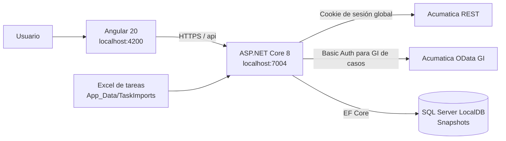
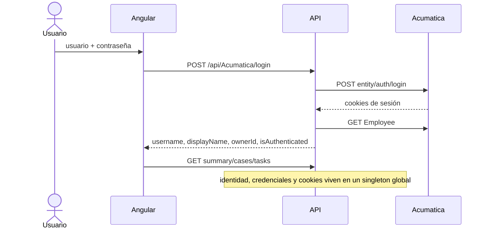

# Auditoría técnica del proyecto KPIs

**Fecha de revisión:** 8 de octubre de 2026  
**Alcance:** análisis estático del código fuente, configuración versionada, modelo de datos, rutas HTTP y flujo Angular–API–Acumatica.  
**Restricción aplicada:** no se modificó código, configuración, base de datos ni comportamiento del sistema. Este documento es el único artefacto creado.

## 1. Resumen ejecutivo

El repositorio es una prueba de concepto full stack para gestión personal de soporte. Angular presenta casos, tareas y métricas; ASP.NET Core actúa como intermediario de Acumatica; SQL Server conserva snapshots de casos y tareas. Los casos se consultan desde una Generic Inquiry OData de Acumatica y las tareas actualmente se cargan desde archivos Excel guardados dentro del backend.

La solución es funcional para una demostración local de **un solo usuario**, pero no es segura para publicación o uso multiusuario. El riesgo dominante es que `IAcumaticaService`, su `HttpClient`, el `CookieContainer`, las credenciales temporales y la identidad actual son objetos singleton compartidos por toda la aplicación. Además, la API no tiene autenticación ni autorización propias y la base no separa datos por usuario o tenant. Como consecuencia, dos usuarios concurrentes podrían compartir o sustituir la sesión ERP y consultar el último snapshot global.

**Valoración general de seguridad:** baja para un despliegue productivo; aceptable solamente como PoC local, aislada y de un solo usuario con datos no sensibles.

## 2. Tecnologías y versiones identificadas

| Capa | Tecnología | Versión observada |
| --- | --- | --- |
| Frontend | Angular (componentes standalone) | `20.3.x` |
| Frontend | Angular CLI / build | `20.3.10` |
| Frontend | TypeScript | `~5.9.2` |
| Frontend | RxJS | `~7.8.0` |
| Frontend | Zone.js | `~0.15.0` |
| UI | lucide-angular | `^1.0.0` |
| Backend | .NET / ASP.NET Core | `net8.0` |
| ORM | Entity Framework Core SQL Server | `8.0.10` |
| API docs | Swashbuckle / Swagger | `6.6.2` |
| Persistencia | SQL Server LocalDB | conexión `Dashboard` del archivo de configuración de ejemplo |
| ERP | Acumatica REST Default Endpoint | `24.200.001` |
| ERP | Generic Inquiry OData | `CR-Cases2018R1` |

Observaciones de configuración:

- El frontend fija la API en `https://localhost:7004`; no existe una capa de `environment` para cambiar el host por ambiente.
- El repositorio incluye `appsettings.Development.example.json`, no un `appsettings.Development.json` efectivo. La ejecución requiere copiarlo o suministrar los valores mediante secretos o variables de entorno.
- El backend valida únicamente que `Acumatica:BaseUrl` sea una URL absoluta.
- `Nullable` e `ImplicitUsings` están habilitados.
- Swagger se expone únicamente en ambiente `Development`.

## 3. Arquitectura actual



Flujo de datos principal:

1. Angular solicita `/api/Acumatica/me` al iniciar.
2. Si el singleton del backend declara una sesión activa, Angular carga resumen, casos y tareas desde SQL.
3. El login envía usuario, contraseña, compañía fija `Clandbus` y sucursal vacía al backend.
4. El backend inicia sesión contra Acumatica y conserva cookies, identidad y el DTO de credenciales en memoria.
5. Una sincronización consulta casos de Acumatica, reutiliza las tareas del snapshot anterior y crea un snapshot SQL nuevo.
6. La actualización de tareas toma el Excel más reciente de `App_Data/TaskImports`, filtra sus filas por propietario y crea otro snapshot.
7. Angular calcula la mayor parte de los KPIs y filtros temporales en el navegador.

## 4. Diagrama de carpetas

```text
clandbus-reference/
├── backend/
│   └── ClandbusERPIntegration/
│       ├── ClandbusERPIntegration.sln
│       └── ClandbusERPIntegration/
│           ├── App_Data/
│           │   └── TaskImports/           # Excel consumidos por la aplicación
│           ├── Configurations/
│           │   └── AcumaticaSettings.cs
│           ├── Controllers/
│           │   ├── AcumaticaController.cs
│           │   ├── DashboardController.cs
│           │   └── HealthController.cs
│           ├── Data/
│           │   └── DashboardDbContext.cs
│           ├── DTOs/                       # Login, usuario, resumen, tendencias y órdenes
│           ├── Interfaces/
│           │   ├── IAcumaticaService.cs
│           │   └── ISynchronizationService.cs
│           ├── Models/
│           │   ├── CaseSnapshot.cs
│           │   ├── TaskSnapshot.cs
│           │   └── SyncRun.cs
│           ├── Properties/
│           │   └── launchSettings.json
│           ├── Services/
│           │   ├── AcumaticaService.cs
│           │   └── SynchronizationService.cs
│           ├── Program.cs
│           ├── appsettings.Development.example.json
│           └── ClandbusERPIntegration.csproj
├── frontend/
│   └── clandbus-dashboard/
│       ├── public/
│       │   └── assets/
│       ├── src/
│       │   ├── app/
│       │   │   ├── core/services/
│       │   │   │   ├── acumatica.service.ts
│       │   │   │   └── dashboard-data.service.ts
│       │   │   ├── features/
│       │   │   │   ├── cases/
│       │   │   │   ├── dashboard/
│       │   │   │   ├── integration/
│       │   │   │   ├── login/
│       │   │   │   ├── productivity/
│       │   │   │   └── tasks/
│       │   │   ├── shared/components/     # Loading y notificaciones
│       │   │   ├── app.config.ts
│       │   │   ├── app.routes.ts
│       │   │   ├── app.ts / app.html / app.scss
│       │   │   └── ...
│       │   ├── main.ts
│       │   └── styles.scss
│       ├── angular.json
│       └── package.json
├── sql/
│   └── maintenance.sql                     # Script independiente de LoginTrace
├── README.md / README.es.md
└── SECURITY.md
```

No se encontraron proyectos de pruebas automatizadas en la estructura revisada.

## 5. Inventario de endpoints internos

Ninguno de los controladores tiene `[Authorize]`. Las indicaciones de “requiere sesión” de la tabla son comprobaciones manuales de `IsLoggedIn`, no autorización de ASP.NET Core.

| Método | Ruta | Función | Sesión comprobada |
| --- | --- | --- | --- |
| `GET` | `/api/Health` | Estado, nombre del proyecto y timestamp UTC | No |
| `POST` | `/api/Acumatica/login` | Inicia sesión ERP y devuelve el usuario resuelto | No |
| `GET` | `/api/Acumatica/me` | Devuelve identidad y bandera de sesión del singleton | No |
| `POST` | `/api/Acumatica/logout` | Cierra la sesión ERP global | No |
| `GET` | `/api/Acumatica/orders` | Consulta órdenes de venta recientes | Indirecta; devuelve lista vacía si no hay sesión |
| `POST` | `/api/Acumatica/update-order` | Actualiza descripción de una orden | Manual en servicio |
| `POST` | `/api/Acumatica/remove-hold` | Quita `Hold` de una orden | Manual en servicio |
| `POST` | `/api/Dashboard/sync` | Crea snapshot: casos nuevos + tareas del snapshot anterior | Indirecta al consultar Acumatica |
| `POST` | `/api/Dashboard/import-tasks` | Recibe `.xlsx`, lo guarda, filtra e importa tareas | Sí, manual |
| `POST` | `/api/Dashboard/import-latest-tasks` | Importa el `.xlsx` local más reciente | Sí, manual |
| `GET` | `/api/Dashboard/task-import-folder` | Revela y crea la ruta física de importación | No |
| `GET` | `/api/Dashboard/summary` | KPIs del último snapshot exitoso | No |
| `GET` | `/api/Dashboard/cases` | Casos del último snapshot exitoso | No |
| `GET` | `/api/Dashboard/tasks` | Tareas del último snapshot exitoso | No |
| `GET` | `/api/Dashboard/trends?period=week|month` | Tendencias de casos creados y tareas concluidas | No |

### Llamadas externas a Acumatica

| Método | Destino | Uso |
| --- | --- | --- |
| `POST` | `entity/auth/login` | Autenticación REST y establecimiento de cookies |
| `POST` | `entity/auth/logout` | Cierre de sesión |
| `GET` | `entity/Default/24.200.001/Employee` | Resolución de nombre e ID de propietario |
| `GET` | `t/{tenant}/api/odata/gi/CR-Cases2018R1` | Muestra de esquema y consulta filtrada de casos |
| `GET` | `entity/Default/{version}/Task` y `/Activity` | Implementado para tareas, pero no usado por la sincronización actual |
| `GET/PUT` | `entity/Default/24.200.001/SalesOrder` | Consulta y modificación heredada de órdenes |

## 6. Autenticación y sesión con Acumatica



Detalles:

- Angular no conserva explícitamente la contraseña; la envía al backend durante el login.
- `AcumaticaService` conserva en memoria el `LoginRequestDto` completo, incluida la contraseña, mientras dure la sesión.
- Las cookies ERP viven en un único `CookieContainer` singleton.
- Para la GI OData de casos el backend vuelve a usar las credenciales almacenadas y construye una cabecera `Authorization: Basic ...` por petición.
- La API no emite cookie, token JWT ni sesión propia para el navegador. `withCredentials: true` no aporta aislamiento porque el backend no autentica al cliente.
- Al recargar Angular, `/me` consulta el estado global del proceso; cualquier navegador puede observar como propia la sesión que esté activa en el singleton.
- El cierre de sesión de un cliente cierra la sesión compartida para todos.

## 7. Filtrado por usuario

### 7.1 Casos

1. Después del login se deriva un nombre desde el identificador (`usuario.apellido` → `Usuario Apellido`).
2. El servicio intenta buscar al usuario en `Employee`, comparando correo/login.
3. Si encuentra coincidencia, toma `ContactID`, `OwnerID`, `BAccountID` o `EmployeeID` y, si existe, el nombre del empleado.
4. Si no resuelve ID y el nombre coincide con el `OwnerName` configurado, utiliza el `OwnerId` fijo de configuración.
5. Consulta una fila de la GI para descubrir dinámicamente una propiedad cuyo nombre contenga `owner`.
6. Ejecuta en Acumatica `$filter=<ownerProperty> eq <ownerId>` con `$top=1000`.
7. Aplica una segunda validación local buscando ID, nombre, correo, parte local del correo o todas las palabras del nombre dentro de propiedades que contengan `owner`.

Limitaciones:

- El descubrimiento heurístico puede escoger una columna `owner` incorrecta.
- Las comparaciones locales usan `Contains`; pueden producir falsos positivos.
- El límite fijo de 1,000 registros no implementa paginación.
- El fallback `OwnerId`/`OwnerName` está acoplado a una persona configurada.
- Si `Employee` falla, el error se ignora y se continúa con información derivada del username.

### 7.2 Tareas

- La sincronización ya no llama a `GetTasksAsync`; copia las tareas del último snapshot.
- Las tareas nuevas provienen del Excel.
- Se aceptan filas cuyo campo `Propietario`, normalizado sin acentos y espacios repetidos, coincida **exactamente** con uno de estos valores normalizados: nombre visible, correo completo o parte local del correo reemplazando puntos por espacios.
- El Excel más reciente se elige por `LastWriteTimeUtc`, luego por nombre de archivo; se excluyen temporales `~$` y archivos menores o iguales a 1,000 bytes.

### 7.3 Persistencia y lectura

El filtro ocurre antes de escribir cada snapshot, pero las tablas no tienen `UserId`, `OwnerId`, `TenantId` ni relación con una sesión. `summary`, `cases`, `tasks` y `trends` siempre leen el **último `SyncRun` exitoso global**. Por ello, el usuario que actualice al final determina lo que reciben todos los clientes.

## 8. Modelo SQL y comportamiento de snapshots

### Tablas inferidas por EF Core

- `Cases`: caso, asunto, cliente, categoría, estado, razón, propietario, fechas de actividad y `CapturedAt`.
- `Tasks`: identificador externo, resumen, estado, porcentaje, categoría, propietario, caso relacionado, fechas y `CapturedAt`.
- `SyncRuns`: inicio, fin, éxito, conteos y texto de error.

Índices definidos:

- `Cases (CaseNumber, CapturedAt)`.
- `Tasks (ExternalId, CapturedAt)`.

La aplicación usa `EnsureCreatedAsync()` al iniciar; no se observaron migraciones EF versionadas. Cada sincronización inserta otro conjunto completo y no hay política de retención. La igualdad exacta de `CapturedAt` liga filas con una ejecución.

El archivo `sql/maintenance.sql` borra filas antiguas y crea un índice en una tabla `LoginTrace`; es un script independiente y no forma parte del modelo `DashboardDbContext` ni del arranque actual.

## 9. Funcionalidades actuales

### 9.1 Shell y sesión

- Barra lateral colapsable; la preferencia se guarda en `localStorage`.
- Modal de inicio de sesión y modal de perfil.
- Indicador de sesión, refresco manual y notificaciones tipo toast.
- El contenido privado se oculta en Angular si `connected$` es falso.
- Tras login se cargan datos locales; luego se recargan cada hora. El temporizador no sincroniza Acumatica, solo relee SQL.

### 9.2 Resumen (`/resumen`)

- KPIs de casos activos, esperando cliente, tareas activas y avance promedio.
- Totales de tareas y conteos de Migraciones, Soporte y Certificaciones.
- Bloque de estado de bandeja y lista de atención necesaria.
- Próximas tareas pendientes y barras de avance.
- Desglose interactivo por categorías y prioridades calculado en frontend.

### 9.3 Casos (`/casos`)

- KPIs de creados, carga activa, esperando cliente y cerrados.
- Filtros de día, semana actual, mes actual, año actual e histórico.
- El periodo usa la fecha más reciente entre creación, último correo entrante y último saliente; por tanto mide “actividad”, no únicamente creación.
- Buscador por número, asunto o cliente y filtro por estado.
- Normalización de estados a Nuevo, Abierto/en proceso, Cliente pendiente y Cerrado.
- Gráfico circular de distribución de estados.
- Detalle del caso con los campos disponibles. No existe endpoint ni modelo de mensajes, por lo que no hay historial real de correos/respuestas.

### 9.4 Tareas (`/tasks`)

- Botón que importa automáticamente el Excel más reciente de la carpeta interna.
- Periodos día, semana, mes, año e histórico; el periodo se calcula con `CompletedAt` o, en su ausencia, `StartAt`.
- KPIs: completadas, tasa de finalización, tiempo medio de cierre y atención requerida/vencidas.
- Comparación de completadas contra el periodo anterior.
- Tarjetas de tarea, detalle modal y vista exclusiva de vencidas.
- Distribución por categoría con porcentajes/gráfico circular.
- Conteos específicos por texto de categoría, por ejemplo Migraciones.

### 9.5 Productividad (`/productividad`)

- Periodos día, semana, mes, año, histórico y rango manual.
- Rango manual desde un calendario desplegable, con validación desde/hasta.
- KPIs de finalización, volumen, vencimiento, avance y composición.
- Serie temporal de tareas iniciadas y completadas; la granularidad cambia según el periodo.
- Distribución por categoría y cálculos de cierre.
- Todos los cálculos se realizan sobre las tareas entregadas al navegador, no mediante agregaciones SQL.

### 9.6 Integración (`/integracion`)

- Presenta conexión, estado de carga y errores.
- Permite disparar la sincronización de casos con Acumatica.
- Si Acumatica rechaza la consulta, Angular conserva y vuelve a cargar el último snapshot local.

### 9.7 Funcionalidad heredada de órdenes

- Existen endpoints y métodos para listar órdenes, cambiar su descripción y quitar `Hold`.
- No forman parte de las rutas visuales actuales del dashboard de soporte.

## 10. Hallazgos de seguridad y arquitectura

### Críticos

#### C-01 — Sesión ERP global compartida

`CookieContainer` e `IAcumaticaService` son singleton. La identidad actual, cookies y credenciales de una persona se comparten entre todas las solicitudes y navegadores. Un segundo login puede cerrar/reemplazar la sesión del primero; `/me` puede revelar la identidad compartida y las operaciones pueden ejecutarse bajo otro usuario.

#### C-02 — API sin autenticación ni autorización propia

No se registra `AddAuthentication`, no se ejecuta `UseAuthentication` y no hay `[Authorize]`. `UseAuthorization()` por sí solo no protege nada. Cualquier cliente que alcance la API puede leer el último snapshot, consultar `/me`, disparar sincronizaciones, revelar la ruta de importación e invocar operaciones de órdenes. CORS no es un control de autorización.

#### C-03 — Datos SQL globales sin partición

Los snapshots no contienen usuario ni tenant. Todas las lecturas públicas retornan la última ejecución exitosa global. Esto permite exposición cruzada de casos/tareas y produce KPIs incorrectos en cuanto exista más de un usuario.

### Altos

#### A-01 — Contraseña retenida y reutilizada en memoria

El DTO de login completo queda en `_currentSession` y se usa para Basic Auth en OData. Aumenta el tiempo de exposición de la credencial y la deja en un servicio singleton.

#### A-02 — Mutaciones ERP expuestas

`update-order`, `remove-hold`, `sync` y `logout` no tienen autorización de aplicación, control de roles, antiforgery, auditoría ni rate limiting. Las dos operaciones de orden pueden modificar Acumatica con la sesión compartida.

#### A-03 — Filtro de propietario heurístico y fallback personal fijo

El filtrado combina descubrimiento de columna, coincidencias parciales y valores `OwnerId`/`OwnerName` configurados. Un cambio de GI o nombres similares puede excluir datos correctos o incluir datos ajenos.

#### A-04 — Lecturas de dashboard disponibles sin sesión

Aunque Angular oculte la UI, los endpoints `summary`, `cases`, `tasks` y `trends` entregan datos directamente sin comprobar identidad. El control visual no constituye seguridad.

### Medios

#### M-01 — Endpoint revela ruta física y modifica el sistema en un GET

`GET /task-import-folder` devuelve la ruta absoluta del servidor y además crea el directorio. Expone detalles internos y viola la expectativa de que GET sea libre de efectos.

#### M-02 — Validación limitada de Excel

Se limita la solicitud manual a 15 MB y extensión `.xlsx`, pero la importación automática no fija un tamaño máximo. El lector carga XML completo con `XDocument.Parse`; un archivo comprimido malicioso o muy grande podría consumir memoria. No se valida el contenido por firma ni un esquema completo de columnas.

#### M-03 — Crecimiento ilimitado de snapshots

Cada actualización duplica casos o tareas del snapshot previo y no existe retención, limpieza ni unicidad. La base crecerá continuamente y los índices no están optimizados para localizar el último `CapturedAt`.

#### M-04 — Errores externos persistidos

`SynchronizationService` guarda `ex.Message` en `SyncRun.Error`. Los errores de consulta incluyen endpoint y hasta 600 caracteres de la respuesta de Acumatica, lo cual puede conservar información interna.

#### M-05 — Configuración de despliegue rígida

La URL de API está repetida en el servicio Angular. `AllowedHosts` es `*` en el ejemplo y no existe configuración Angular por ambiente. Esto dificulta desplegar de forma controlada y puede inducir a configuraciones inseguras.

#### M-06 — Esquema creado sin migraciones

`EnsureCreated` no ofrece evolución versionada ni rollback. Cambios de modelo pueden dejar instalaciones existentes incompatibles o requerir recrear datos.

#### M-07 — Límite de 1,000 sin paginación

Casos y entidades Acumatica usan `$top=1000` y no procesan `nextLink`. Los KPIs pueden quedar incompletos silenciosamente.

### Bajos / calidad y mantenibilidad

#### B-01 — Lógica de KPI duplicada en el navegador

Estados, periodos, completitud y categorías se interpretan con reglas de texto distintas entre resumen, casos, tareas y productividad. Esto permite que dos pantallas presenten cifras diferentes para los mismos datos.

#### B-02 — Tipado débil en Angular

Predominan `any` y arrays sin modelos de dominio, lo que reduce la detección temprana de cambios de contrato.

#### B-03 — Funciones implementadas pero desconectadas

`GetTasksAsync`, `MapTask` e `IsCurrentUserRecord` existen, pero el flujo de sincronización actual no los usa. Las tareas dependen exclusivamente del Excel o del snapshot anterior.

#### B-04 — Sin pruebas automatizadas observables

No se localizaron pruebas unitarias, de integración, de contratos, seguridad ni de importación de Excel. Los cambios en estados, fechas y filtros carecen de red de regresión.

#### B-05 — Documentación desactualizada parcialmente

El README describe principalmente órdenes de venta y no inventaría todas las rutas y funciones actuales de casos, tareas, productividad y snapshots.

## 11. Evaluación de controles positivos existentes

- Acumatica se consume desde el backend; el navegador no llama directamente al ERP.
- La validación TLS del `HttpClientHandler` no está deshabilitada.
- No se observaron credenciales literales en el código revisado; se ingresan en ejecución.
- CORS limita orígenes a los dos hosts locales de Angular.
- Swagger queda condicionado al ambiente de desarrollo.
- El upload manual usa nombre saneado, `Path.GetFileNameWithoutExtension`, extensión `.xlsx` y límite de 15 MB.
- Las consultas EF visibles usan LINQ parametrizado, sin concatenación SQL manual.
- La GI filtra primero en Acumatica y vuelve a validar propietario localmente.
- Los errores de login que regresan al navegador son genéricos.

Estos controles ayudan, pero no compensan la falta de identidad propia, aislamiento de sesión y partición de datos.

## 12. Matriz de riesgo resumida

| Área | Estado | Riesgo principal |
| --- | --- | --- |
| Autenticación de la aplicación | No implementada | Acceso anónimo a API |
| Autorización | No implementada | Lecturas y mutaciones sin roles |
| Sesión Acumatica | Singleton global | Suplantación/exposición entre usuarios |
| Filtrado de casos | Remoto + validación heurística | Falsos positivos/negativos |
| Filtrado de tareas | Coincidencia exacta de nombre normalizado | Dependencia del formato Excel |
| Aislamiento SQL | No existe | Último snapshot visible para todos |
| Transporte | HTTPS local / TLS ERP predeterminado | Adecuado en desarrollo |
| Secretos | Entrada en runtime, retenida en memoria | Contraseña global de larga vida |
| Auditoría | Solo `SyncRun`, sin actor | No atribuible a usuario |
| Disponibilidad | Sin límites/paginación robusta | DoS por Excel y datos truncados |
| Pruebas | No observadas | Alto riesgo de regresión |

## 13. Prioridad recomendada para una fase posterior

Sin implementar aún, el orden técnico recomendado sería:

1. Diseñar autenticación propia e identidad por solicitud.
2. Aislar cookies/credenciales de Acumatica por usuario y eliminar el singleton de sesión.
3. Particionar snapshots y consultas por usuario/tenant; autorizar todos los endpoints.
4. Retirar o proteger las mutaciones heredadas de órdenes y el endpoint de ruta física.
5. Centralizar definiciones de estados, fechas y KPIs en contratos compartidos o backend.
6. Incorporar paginación, validación robusta de Excel, retención de snapshots y migraciones EF.
7. Agregar pruebas de seguridad, integración, filtros temporales y consistencia de KPIs.

## 14. Conclusión

La aplicación ya cubre el flujo visual y analítico de una PoC personal: login ERP, captura de casos, importación de tareas, snapshots, KPIs y filtros. Su diseño actual depende explícitamente de un único proceso y un único usuario. La apariencia de sesión individual en Angular no corresponde a una frontera de seguridad real en el backend. Antes de conectar información productiva o permitir más de un usuario, los hallazgos C-01, C-02 y C-03 deben considerarse bloqueadores de arquitectura.

