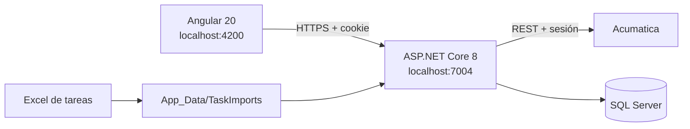

# ClandBus Dashboard de Gestión de Soporte

Aplicación web independiente para consultar y analizar el trabajo personal registrado en Acumatica. Integra casos, tareas importadas desde Excel, métricas operativas, productividad y una bitácora profesional.

> El repositorio no contiene la URL privada del ERP, credenciales, archivos Excel reales ni datos de clientes. Cada instalación debe aportar su propia configuración local.

## Funcionalidades

- Inicio y cierre de sesión contra Acumatica sin guardar la contraseña.
- Sesiones aisladas por navegador mediante cookie HTTP-only.
- Sincronización de casos asociados al usuario autenticado.
- Importación automática del Excel más reciente desde una carpeta interna.
- Filtros por día, semana, mes, trimestre, año, histórico y rango personalizado.
- KPIs interactivos con el detalle de los registros que los componen.
- Distribución de casos por estado y tareas por categoría.
- Productividad, evolución temporal, cumplimiento y bitácora profesional.
- Exportación compatible con Excel y salida mediante impresión a PDF.
- Historial SQL separado por `UserKey`.

## Arquitectura



El navegador nunca accede directamente a Acumatica ni a SQL Server. El backend autentica, conserva la sesión, filtra por usuario y expone únicamente los datos necesarios para Angular.

## Tecnologías

| Capa | Tecnología |
| --- | --- |
| Frontend | Angular 20.3, TypeScript 5.9, RxJS 7.8, SCSS, Lucide |
| Backend | ASP.NET Core 8, C#, Entity Framework Core 8 |
| Datos | SQL Server / LocalDB |
| Integración | REST API de Acumatica `24.200.001` |
| Pruebas | Jasmine, Karma y Chrome |

## Estructura

```text
ClandbusDashboard/
├── backend/ClandbusERPIntegration/  API, integración y persistencia
├── frontend/clandbus-dashboard/     Aplicación Angular
├── sql/                              Migración, rollback y mantenimiento
├── AUDITORIA_PROYECTO_KPIs.md        Auditoría técnica
├── IMPLEMENTACION_MEJORAS_KPIS.md    Cambios y pruebas
├── CONTRIBUTING.md                    Flujo de contribución
├── SECURITY.md                       Seguridad
└── README.md                         Guía principal
```

## Ramas y forma de trabajo

| Rama | Propósito | Recomendación |
| --- | --- | --- |
| `main` | Versión estable y revisada | Integrar únicamente mediante Pull Request |
| `desarrollo` | Pruebas, integración y validación | Usarla antes de promover cambios a `main` |

Para descargar únicamente la versión de desarrollo:

```powershell
git clone --branch desarrollo --single-branch https://github.com/Polar2565/clandbus-dashboard-kpis.git
cd clandbus-dashboard-kpis
```

Las reglas completas están en [CONTRIBUTING.md](CONTRIBUTING.md). Nunca incluyas configuraciones locales, URLs privadas, credenciales, cookies, archivos Excel reales o datos de clientes en commits, ramas, Issues o Pull Requests.

## Requisitos mínimos

| Requisito | Versión o condición |
| --- | --- |
| Sistema | Windows 10/11 de 64 bits |
| Backend | .NET SDK 8.x |
| Frontend | Node.js 20 LTS o 22 LTS y npm 10+ |
| Base de datos | SQL Server 2019+ o SQL Server Express LocalDB |
| Navegador | Chrome o Edge actualizado |
| ERP | Una instancia de Acumatica accesible y una cuenta autorizada |
| Datos de tareas | Exportación `.xlsx` de la pantalla Tareas de Acumatica |

Visual Studio 2022 con la carga de trabajo **ASP.NET y desarrollo web** y Visual Studio Code son opcionales. También es posible ejecutar todo desde PowerShell.

## Instalación paso a paso

### 1. Clonar y abrir el proyecto

```powershell
git clone https://github.com/Polar2565/clandbus-dashboard-kpis.git
cd clandbus-dashboard-kpis
```

Para abrir el backend en Visual Studio, utiliza `backend\ClandbusERPIntegration\ClandbusERPIntegration.sln`. Para abrir el frontend en VS Code:

```powershell
code frontend\clandbus-dashboard
```

### 2. Configurar la API

```powershell
cd backend\ClandbusERPIntegration\ClandbusERPIntegration
Copy-Item appsettings.Development.example.json appsettings.Development.json
```

Edita el nuevo `appsettings.Development.json` y reemplaza solamente los valores de tu entorno:

| Campo | Qué debes colocar |
| --- | --- |
| `Acumatica:BaseUrl` | URL base privada de tu instancia, terminada en `/` |
| `Acumatica:EndpointVersion` | Versión del endpoint publicado en tu ERP |
| `Acumatica:Company` | Tenant o compañía exacta de Acumatica |
| `Acumatica:Branch` | Sucursal, o una cadena vacía si no aplica |
| `OwnerId` / `OwnerName` | Déjalos vacíos; solo son respaldo si tu endpoint no identifica al usuario |
| `ConnectionStrings:Dashboard` | Cadena de conexión de SQL Server o LocalDB |

`appsettings.Development.json` está ignorado por Git. Nunca pongas usuario, contraseña, cookie, URL privada o datos del cliente en el archivo de ejemplo versionado.

### 3. Preparar SQL Server

La API crea su esquema con Entity Framework. Para actualizar una base anterior:

```powershell
sqlcmd -S "(localdb)\MSSQLLocalDB" -d ClandbusProductivity -E -b -i sql\001_kpi_user_isolation_and_professional_records.sql
```

No ejecutes el rollback sin respaldo.

### 4. Instalar Angular

```powershell
cd frontend\clandbus-dashboard
npm ci
cd ..\..
```

### 5. Ejecutar backend y frontend

Terminal 1:

```powershell
dotnet run --project backend\ClandbusERPIntegration\ClandbusERPIntegration\ClandbusERPIntegration.csproj --launch-profile https
```

Terminal 2:

```powershell
cd frontend\clandbus-dashboard
npm start
```

Abre `http://127.0.0.1:4200`. La API queda en `https://localhost:7004`, Swagger en `/swagger` y Salud en `/api/Health`.

### 6. Descargar y preparar el Excel de tareas

La API obtiene los casos directamente de Acumatica, pero las tareas se cargan desde una exportación de Excel:

1. En Acumatica abre la pantalla **Tareas**.
2. Aplica el alcance que quieras analizar y exporta los registros como `.xlsx`.
3. Conserva los encabezados originales. El importador utiliza, entre otros: `Resumen`, `Estado`, `(%) Terminado`, `Fecha de Inicio`, `Fecha Vencimiento`, `Categoría`, `Propietario` y `Entidad Relacionada`.
4. Copia el archivo a `backend\ClandbusERPIntegration\ClandbusERPIntegration\App_Data\TaskImports`.
5. Si la carpeta todavía no existe, créala. La API también la crea automáticamente en el primer intento de importación.
6. No renombres el archivo para reemplazar otro: puedes conservar varias exportaciones. El botón **Actualizar tareas** selecciona automáticamente el `.xlsx` cuya fecha de modificación sea más reciente.

Los `.xlsx` de esa carpeta están excluidos por `.gitignore`; nunca deben subirse porque pueden contener datos personales u operativos.

### 7. Primera carga de información

1. Abre `http://127.0.0.1:4200` e inicia sesión con una cuenta autorizada de Acumatica.
2. En **Integración**, pulsa **Sincronizar ahora** para obtener únicamente los casos asociados al usuario autenticado.
3. En **Tareas**, pulsa **Actualizar tareas** para consumir el Excel más reciente de la carpeta interna.
4. Comprueba que Resumen, Casos, Tareas y Productividad tengan información.
5. Si aparecen ceros, verifica el propietario del Excel, los permisos de la cuenta, el tenant y la versión del endpoint.

## Pruebas

```powershell
dotnet build backend\ClandbusERPIntegration\ClandbusERPIntegration\ClandbusERPIntegration.csproj -c Release
npm --prefix frontend\clandbus-dashboard run build
npm --prefix frontend\clandbus-dashboard test -- --watch=false
```

La suite actual contiene 9 pruebas Angular. La sincronización real requiere una sesión autorizada.

## Verificación manual

1. Sin sesión no deben mostrarse datos privados.
2. Los filtros deben actualizar KPIs y detalle simultáneamente.
3. Los KPIs interactivos deben mostrar los registros que los componen.
4. Deben funcionar búsqueda, estado y actividad de Casos.
5. Tareas debe importar el Excel más reciente y mostrar las vencidas.
6. Productividad debe responder a todos los periodos y al rango manual.
7. El CSV debe abrir en Excel y el reporte debe poder guardarse como PDF.
8. Al cerrar sesión, la información personal debe desaparecer.

## Seguridad

- No publiques `appsettings.Development.json`, credenciales, cookies, exportaciones ni archivos reales de clientes.
- La URL del ERP, el tenant, la sucursal y la cadena SQL se configuran exclusivamente en el archivo local ignorado por Git.
- El frontend no contiene ni recibe la URL privada de Acumatica.
- Las contraseñas no se almacenan en SQL ni en el código.
- Los endpoints privados requieren una sesión backend válida.
- Snapshots y registros profesionales se consultan por `UserKey`.
- Reiniciar la API obliga a iniciar sesión nuevamente.
- Antes de publicar revisa `git status`, `.gitignore`, [SECURITY.md](SECURITY.md) y la lista de seguridad de [CONTRIBUTING.md](CONTRIBUTING.md).

## Limitaciones

- Acumatica todavía no entrega el contenido completo del hilo de correos usado aquí.
- “Exportar Excel” genera CSV UTF-8, no un `.xlsx` binario.
- El PDF utiliza el diálogo de impresión.
- La consulta Acumatica aún no pagina por encima del límite configurado.

## Documentación

- [Backend](backend/ClandbusERPIntegration/README.md)
- [Frontend](frontend/clandbus-dashboard/README.md)
- [Auditoría](AUDITORIA_PROYECTO_KPIs.md)
- [Implementación y pruebas](IMPLEMENTACION_MEJORAS_KPIS.md)
- [Seguridad](SECURITY.md)

## Repositorio

Este proyecto se mantiene en [Polar2565/clandbus-dashboard-kpis](https://github.com/Polar2565/clandbus-dashboard-kpis). Es un repositorio independiente y no modifica integraciones o repositorios anteriores.

---

© 2026 Javier Solís. Todos los derechos reservados.

El código fuente puede consultarse públicamente, pero no se autoriza su copia, modificación, distribución, sublicenciamiento ni uso comercial sin autorización previa y por escrito del titular. Consulta [LICENSE](LICENSE) para conocer los términos completos.
